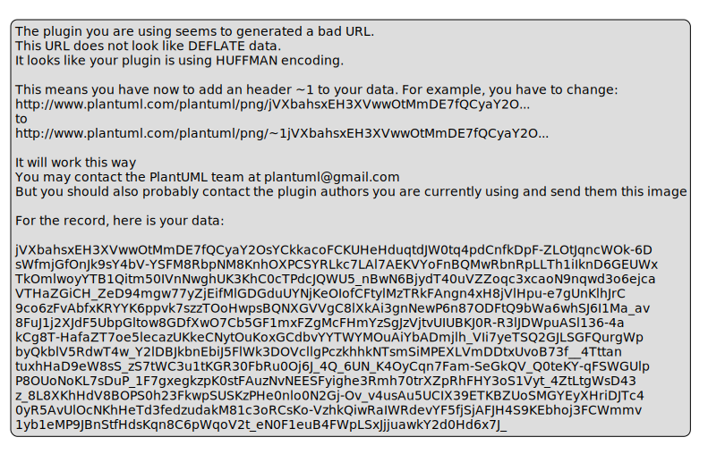
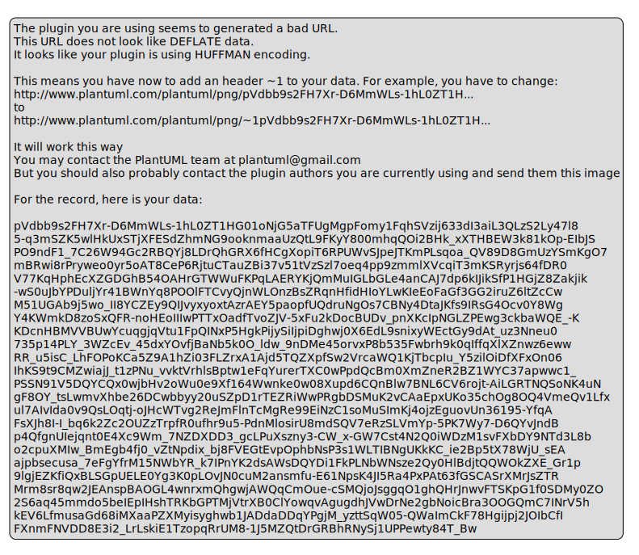
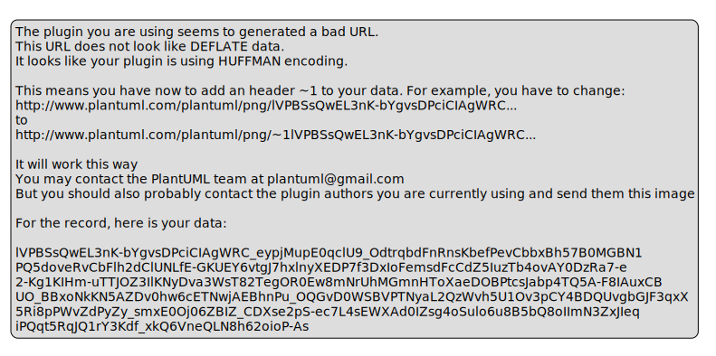
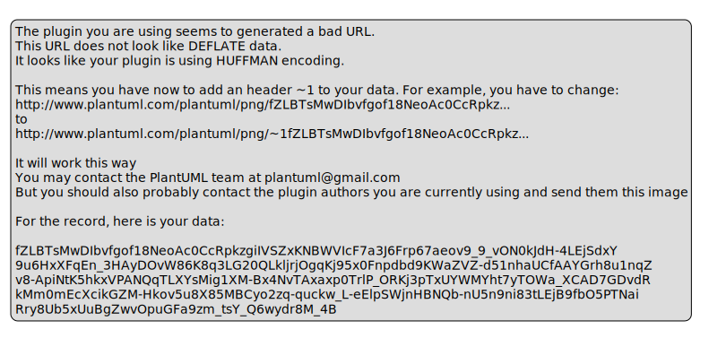
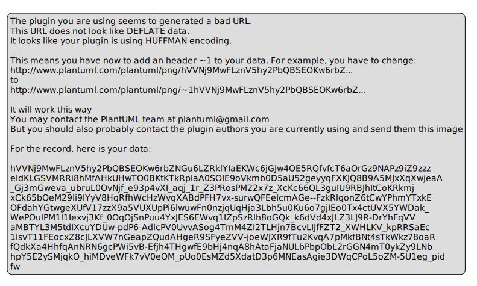

# UML Diagrams

This document contains all the UML diagrams for the PLD-AGILE project.

## 📁 Folder Structure

```
UML_Diagrams/
├── README.md                    # This file
├── convert_plantuml.py          # Script to generate SVG from PlantUML
├── sprint_diagrams/             # Sprint kanban boards and planning
│   ├── Sprint1.svg
│   ├── Sprint1.pdf
│   ├── Sprint1Code.svg
│   ├── Sprint1Code.pdf
│   ├── Sprint2.svg
│   ├── Sprint2.pdf
│   ├── Sprint3.svg
│   └── Sprint3.pdf
├── plantuml_sources/            # PlantUML source files + generated SVGs
│   ├── UC_Diagram.puml / .svg
│   ├── data_model_class_diagram.puml / .svg
│   ├── parse_map_sequence.puml / .svg
│   ├── parse_deliveries_sequence.puml / .svg
│   └── P_Diagram.puml / .svg
└── documentation/               # Additional documentation
    ├── Glossary_AGILE.pdf
    ├── Use_case_description.pdf
    └── Retrospective_Agile_Team_Photos.docx
```

## Table of Contents
- [Sprint Diagrams](#sprint-diagrams)
- [Use Case Diagram](#use-case-diagram)
- [Class Diagram](#class-diagram)
- [Sequence Diagrams](#sequence-diagrams)
- [Package Diagram](#package-diagram)
- [Additional Documentation](#additional-documentation)

---

## Sprint Diagrams

### Sprint 1


[📄 View Sprint 1 PDF](sprint_diagrams/Sprint1.pdf)

### Sprint 1 Code


[📄 View Sprint 1 Code PDF](sprint_diagrams/Sprint1Code.pdf)

### Sprint 2


[📄 View Sprint 2 PDF](sprint_diagrams/Sprint2.pdf)

### Sprint 3


[📄 View Sprint 3 PDF](sprint_diagrams/Sprint3.pdf)

---

## Use Case Diagram



[📝 View UC_Diagram.puml source](plantuml_sources/UC_Diagram.puml)

---

## Class Diagram

### Data Model Class Diagram



[📝 View data_model_class_diagram.puml source](plantuml_sources/data_model_class_diagram.puml)

---

## Sequence Diagrams

### Parse Map Sequence



[📝 View parse_map_sequence.puml source](plantuml_sources/parse_map_sequence.puml)

### Parse Deliveries Sequence



[📝 View parse_deliveries_sequence.puml source](plantuml_sources/parse_deliveries_sequence.puml)

---

## Package Diagram



[📝 View P_Diagram.puml source](plantuml_sources/P_Diagram.puml)

---

## Additional Documentation

### Project Documentation
- 📖 [Glossary (PDF)](documentation/Glossary_AGILE.pdf) - Project terminology and definitions
- 📋 [Use Case Descriptions (PDF)](documentation/Use_case_description.pdf) - Detailed use case specifications
- 📸 [Team Retrospective (DOCX)](documentation/Retrospective_Agile_Team_Photos.docx) - Sprint retrospectives and team reflections

### Sprint Documentation
- 📊 [Sprint 1 PDF](sprint_diagrams/Sprint1.pdf)
- 📊 [Sprint 1 Code PDF](sprint_diagrams/Sprint1Code.pdf)
- 📊 [Sprint 2 PDF](sprint_diagrams/Sprint2.pdf)
- 📊 [Sprint 3 PDF](sprint_diagrams/Sprint3.pdf)

---

## 📝 Notes

- ✅ **All diagrams are viewable as SVG images** - Sprint diagrams and PlantUML diagrams are all rendered as SVG
- ✅ **SVG images are embedded** - View directly in this markdown file (GitHub, VS Code, etc.)
- ✅ **PlantUML source files included** - Edit and regenerate diagrams as needed
- ✅ **PDF documentation** - Detailed sprint and use case documentation
- ✅ **Organized structure** - Files grouped logically for easy navigation
- ✅ **Automated conversion** - Use `convert_plantuml.py` to regenerate SVGs from PlantUML sources

## 🔧 Working with PlantUML

### Viewing PlantUML Diagrams

To render PlantUML diagrams, you can use:
- 🌐 [PlantUML Online Server](http://www.plantuml.com/plantuml/uml/)
- 🔌 VS Code extension: "PlantUML" by jebbs
- 💻 Command line: `plantuml *.puml`

### Generating SVG from PlantUML

To generate/regenerate SVG files from PlantUML source files:

**Option 1: Using the Python script (generates HTML with embedded SVG)**
```bash
python convert_plantuml.py
```
This creates HTML files in `plantuml_sources/` that you can open in your browser. Each HTML file:
- Displays the diagram with SVG rendering
- Has a "Download SVG" button to get the SVG file
- Allows right-click "Save Image As..." to save as SVG
- Shows the PlantUML source code

**Option 2: Using PlantUML command line (if installed)**
```bash
cd plantuml_sources
plantuml -tsvg *.puml
```

**Option 3: Using VS Code PlantUML extension**
- Install the "PlantUML" extension by jebbs
- Open any `.puml` file
- Press `Alt+D` to preview
- Use the export function to save as SVG

**Option 4: Online services**
- [PlantUML Online Editor](http://www.plantuml.com/plantuml/uml/)
- [Kroki.io](https://kroki.io/) - Supports PlantUML and many other diagram types

---

## 📂 Quick Access

| Category | Files |
|----------|-------|
| **Sprint Boards** | [sprint_diagrams/](sprint_diagrams/) |
| **UML Sources** | [plantuml_sources/](plantuml_sources/) |
| **Documentation** | [documentation/](documentation/) |

---

*Last updated: October 20, 2025*
