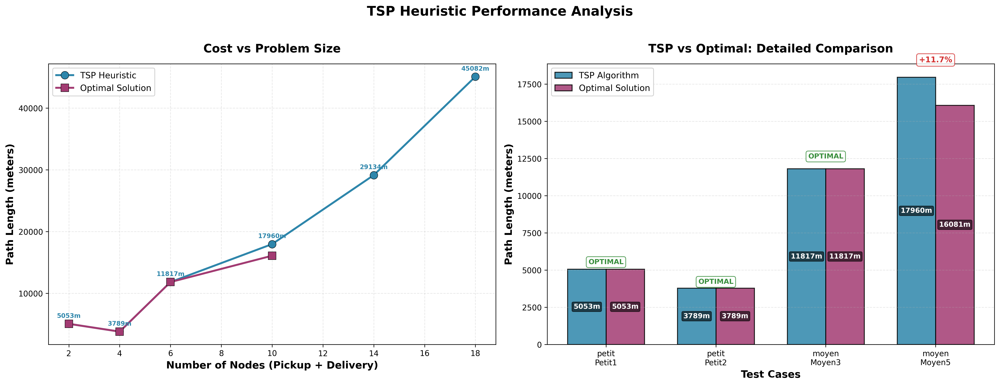

# Project Deliverables

This document contains all the deliverables (UML diagrams, sprint boards, documentation, and performance analysis) for the PLD-AGILE project.

## Folder Structure

```
deliverables/
├── README.md                    # This file
├── convert_plantuml.py          # Script to generate SVG from PlantUML and PDF files
├── sprint_diagrams/             # Sprint kanban boards (PDFs)
│   ├── Sprint1.pdf
│   ├── Sprint1Code.pdf
│   ├── Sprint2.pdf
│   └── Sprint3.pdf
├── plantuml_sources/            # PlantUML source files (.puml)
│   ├── UC_Diagram.puml
│   ├── class_diagram.puml
│   ├── parse_map_sequence.puml
│   ├── parse_deliveries_sequence.puml
│   └── package_diagram.puml
├── generated_svgs/              # Generated SVG files from PlantUML and PDFs
│   ├── UC_Diagram.svg
│   ├── class_diagram.svg
│   ├── package_diagram.svg
│   ├── parse_deliveries_sequence.svg
│   ├── parse_map_sequence.svg
│   ├── Sprint1.svg
│   ├── Sprint1Code.svg
│   ├── Sprint2.svg
│   └── Sprint3.svg
└── documentation/               # Additional documentation
    ├── Glossary_AGILE.pdf
    ├── Use_case_description.pdf
    ├── Opti_tour_architectural_design.pdf
    ├── Opti_tour_User_stories.pdf
    ├── Retrospective_Agile_Team_Photos.odt
    ├── Retrospective_Agile_Team_Photos.pdf
    └── Sprint_Feedback.pdf
```

## Table of Contents
- [Project Deliverables](#project-deliverables)
  - [Folder Structure](#folder-structure)
  - [Table of Contents](#table-of-contents)
  - [Sprint Diagrams](#sprint-diagrams)
    - [Sprint 1](#sprint-1)
    - [Sprint 1 Code](#sprint-1-code)
    - [Sprint 2](#sprint-2)
    - [Sprint 3](#sprint-3)
  - [Use Case Diagram](#use-case-diagram)
  - [Class Diagrams](#class-diagrams)
    - [Data Model Class Diagram](#data-model-class-diagram)
    - [Package Diagram](#package-diagram)
  - [Sequence Diagrams](#sequence-diagrams)
    - [Parse Map Sequence](#parse-map-sequence)
    - [Parse Deliveries Sequence](#parse-deliveries-sequence)
  - [Performance Analysis](#performance-analysis)
    - [Performance Report](#performance-report)
    - [Performance Analysis Diagram](#performance-analysis-diagram)
  - [Additional Documentation](#additional-documentation)
    - [Project Documentation](#project-documentation)
    - [Sprint Documentation](#sprint-documentation)
    - [Project Planning](#project-planning)
  - [Quick Access](#quick-access)
  - [Test Coverage Report](#test-coverage-report)
  - [AI Disclaimer](#ai-disclaimer)

---

## Sprint Diagrams

### Sprint 1
[](https://raw.githubusercontent.com/WiredMind2/PLD-AGILE/main/deliverables/generated_svgs/Sprint1.svg)

[View Sprint 1 PDF](sprint_diagrams/Sprint1.pdf)

### Sprint 1 Code
[](https://raw.githubusercontent.com/WiredMind2/PLD-AGILE/main/deliverables/generated_svgs/Sprint1Code.svg)

[View Sprint 1 Code PDF](sprint_diagrams/Sprint1Code.pdf)

### Sprint 2
[](https://raw.githubusercontent.com/WiredMind2/PLD-AGILE/main/deliverables/generated_svgs/Sprint2.svg)

[View Sprint 2 PDF](sprint_diagrams/Sprint2.pdf)

### Sprint 3
[](https://raw.githubusercontent.com/WiredMind2/PLD-AGILE/main/deliverables/generated_svgs/Sprint3.svg)

[View Sprint 3 PDF](sprint_diagrams/Sprint3.pdf)

---

## Use Case Diagram

[](https://raw.githubusercontent.com/WiredMind2/PLD-AGILE/main/deliverables/generated_svgs/UC_Diagram.svg)

[View UC_Diagram.puml source](plantuml_sources/UC_Diagram.puml)

---

## Class Diagrams

### Data Model Class Diagram

[](https://raw.githubusercontent.com/WiredMind2/PLD-AGILE/main/deliverables/generated_svgs/class_diagram.svg)

[View class_diagram.puml source](plantuml_sources/class_diagram.puml)

### Package Diagram

[](https://raw.githubusercontent.com/WiredMind2/PLD-AGILE/main/deliverables/generated_svgs/package_diagram.svg)

[View package_diagram.puml source](plantuml_sources/package_diagram.puml)

---

## Sequence Diagrams

### Parse Map Sequence

[](https://raw.githubusercontent.com/WiredMind2/PLD-AGILE/main/deliverables/generated_svgs/parse_map_sequence.svg)

[View parse_map_sequence.puml source](plantuml_sources/parse_map_sequence.puml)

### Parse Deliveries Sequence

[](https://raw.githubusercontent.com/WiredMind2/PLD-AGILE/main/deliverables/generated_svgs/parse_deliveries_sequence.svg)

[View parse_deliveries_sequence.puml source](plantuml_sources/parse_deliveries_sequence.puml)

---

## Performance Analysis

### Performance Report

[View TSP Implementation Report (Markdown)](../backend/tools/TSP_implementation.md) - Comprehensive analysis of our TSP implementation.

### Performance Analysis Diagram

 - Visual representation of algorithm performance metrics and comparisons.

---

## Additional Documentation

### Project Documentation
- [Glossary (PDF)](documentation/Glossary_AGILE.pdf) - Project terminology and definitions
- [Use Case Descriptions (PDF)](documentation/Use_case_description.pdf) - Detailed use case specifications
- [Architectural Design (PDF)](documentation/Opti_tour_architectural_design.pdf) - System architecture and design patterns
- [User Stories (PDF)](documentation/Opti_tour_User_stories.pdf) - Detailed user stories and acceptance criteria
- [Team Retrospective (PDF)](documentation/Retrospective_Agile_Team_Photos.pdf) - Sprint retrospectives (PDF version)
- [Sprint Feedback (PDF)](documentation/Sprint_Feedback.pdf) - Comprehensive sprint feedback and retrospective analysis

### Sprint Documentation
- [Sprint 1 PDF](sprint_diagrams/Sprint1.pdf)
- [Sprint 1 Code PDF](sprint_diagrams/Sprint1Code.pdf)
- [Sprint 2 PDF](sprint_diagrams/Sprint2.pdf)
- [Sprint 3 PDF](sprint_diagrams/Sprint3.pdf)

### Project Planning
- [Iteration Planning (PDF)](documentation/iteration_planning.pdf) - Sprint planning and milestone documentation

---

## Quick Access

| Category | Files |
|----------|-------|
| **Sprint Boards** | [sprint_diagrams/](sprint_diagrams/) |
| **PlantUML Sources** | [plantuml_sources/](plantuml_sources/) |
| **Generated SVGs** | [generated_svgs/](generated_svgs/) |
| **Documentation** | [documentation/](documentation/) |
| **TSP Algorithm Analysis** | [TSP_implementation.md](../backend/tools/TSP_implementation.md), [tsp_performance_analysis.png](../backend/tools/benchmark_results/tsp_performance_analysis.png) |

---

## Test Coverage Report

You can view the test coverage report generated by pytest [here](https://htmlpreview.github.io/?https://github.com/WiredMind2/PLD-AGILE/blob/main/backend/htmlcov/index.html).
[Here](../backend/htmlcov) is the link to the report folder

---

## AI Disclaimer
We have used generative AI to help us in this project, for both our scripts and our deliverables.

---

*Last updated: November 5, 2025*
